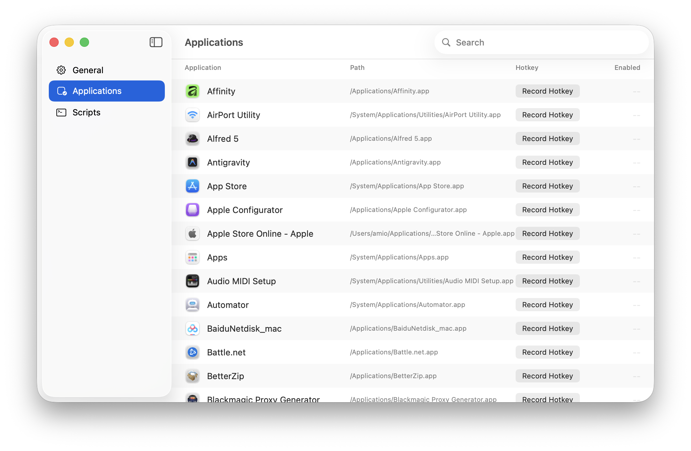

# KeyMagic

An Application Launcher, and Shell Script Runner. A Minimal hotkey manager for Mac.



Install from [GitHub Releases](https://github.com/amio/KeyMagic/releases)

## Development

KeyMagic is built with SwiftUI and Swift 6, targeting macOS 15+.

Use `make` commands for common tasks:

```
help           Show available targets
setup          Install required tools and generate Xcode project
gen            Regenerate Xcode project from project.yml (run after editing project.yml)
open           Regenerate and open project in Xcode
build          Build app — Debug (via xcodebuild)
release        Build app — Release (via xcodebuild)
run            Build (Debug) and run app from the CLI
test           Run unit tests via swift test (fast, no Xcode needed)
uitest         Run UI tests via xcodebuild
test-all       Run all tests (unit + UI)
format         Auto-format all Swift source files with swift-format
lint           Lint Swift source files with swift-format (no writes)
version-patch  Bump patch version (1.0.0 → 1.0.1), commit and tag
version-minor  Bump minor version (1.0.0 → 1.1.0), commit and tag
version-major  Bump major version (1.0.0 → 2.0.0), commit and tag
version-build  Bump build number only, no semver change, commit and tag
archive        Create a Release archive (.xcarchive) signed with Developer ID
export         Export archive as a Developer ID-signed .app ready for notarization
notarize       Submit exported .app to Apple Notary Service and staple the ticket
dist           Full distribution pipeline: archive → export → notarize → staple → DMG
dmg            Package the notarized .app into a distributable DMG
clean          Remove build artifacts (keeps .xcodeproj)
reset          Full reset — also removes .xcodeproj (run 'make gen' afterwards)
ci             Full CI pipeline: lint → unit tests → release build
```
